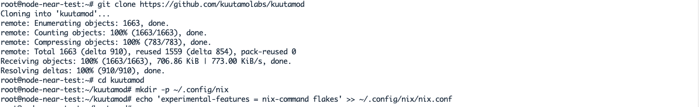
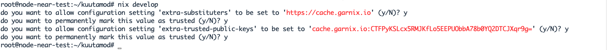

### Triển khai kuutamod trên localnet

Đầu tiên bạn cần chuẩn bị thiết bị của mình chạy một trong các hệ điều hành sau: Linux, MacOS, Windows (WSL2), Docker.

Trong bài viết này mình sẽ hướng dẫn bạn cài đặt trên linux cụ thể là Ubuntu 20.04. Đối với các hệ điều hành khác bạn tham khảo tại đây.

Các bạn ssh vào vps cài hệ điều hành Ubuntu 20.04 và tiến hành cài đặt.

#### Install the nix package manager
```
sudo apt update && sudo apt upgrade -y
```
```
sh <(curl -L https://nixos.org/nix/install) --daemon
```
Xuất hiện 3 câu hỏi bạn nhấn Y và Enter để tiếp tục. Nhấn Enter để hoàn tất cài đặt.


Mở một tab kết nối ssh mới, chạy lệnh
```
nix-shell -p nix-info --run "nix-info -m"
```


```
sudo systemctl restart nix-daemon.service
```
#### Install kuutamod

Mở một tab kết nối ssh mới, chạy lệnh
```
git clone https://github.com/kuutamolabs/kuutamod
```
```
cd kuutamod
```
```
mkdir -p ~/.config/nix
```
```
echo 'experimental-features = nix-command flakes' >> ~/.config/nix/nix.conf
```



```
nix develop
```
Khi được hỏi bạn nhấn Y và Enter để tiếp tục.



Kiểm tra

```
hivemind
```


Mở một tab kết nối ssh mới, chạy lệnh

```
cd kuutamod
```
```
nix develop
```
```
cargo build --release
```


#### Khởi chạy Kuutamod

Trong thư mục kuutamod, chạy lệnh
```
./target/release/kuutamod --neard-home .data/near/localnet/kuutamod0/ \
--voter-node-key .data/near/localnet/kuutamod0/voter_node_key.json \
--validator-node-key .data/near/localnet/node3/node_key.json \
--validator-key .data/near/localnet/node3/validator_key.json \
--near-boot-nodes $(jq -r .public_key < .data/near/localnet/node0/node_key.json)@127.0.0.1:33301
```


Kiểm tra xem node của bạn có trở thành validator
```
curl http://localhost:2233/metrics
```


Đường dẫn tệp dữ liệu của node
```
ls -la .data/near/localnet/kuutamod0/
```


#### Khởi chạy phiên bản thứ 2 Kuutamod

Mở một tab kết nối ssh mới, chạy lệnh

```
cd kuutamod
```
```
nix develop
```
```
cargo build --release
```
```
./target/release/kuutamod \
--exporter-address 127.0.0.1:2234 \
--validator-network-addr 0.0.0.0:24569 \
--voter-network-addr 0.0.0.0:24570 \
--neard-home .data/near/localnet/kuutamod1/ \
--voter-node-key .data/near/localnet/kuutamod1/voter_node_key.json \
--validator-node-key .data/near/localnet/node3/node_key.json \
--validator-key .data/near/localnet/node3/validator_key.json \
--near-boot-nodes $(jq -r .public_key < .data/near/localnet/node0/node_key.json)@127.0.0.1:33301
```


Bạn chỉ cần thay đổi port, thư mục cho --voter-node-keyvà --validator-node-key là có thể tạo được nhiều phiên bản kuutamod hơn nữa.
